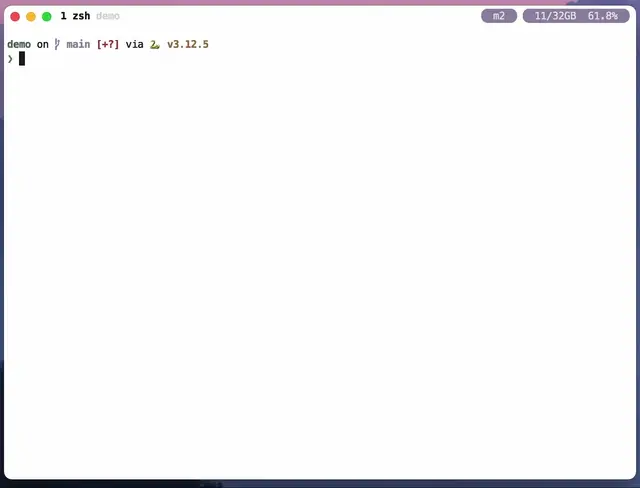

# Sia


An LLM assistant for Neovim with support for

- [Neovim builtin diff tool](https://neovim.io/doc/user/diff.html).
- Simple chat
- Simple insert

## 💡 Idea

The idea behind this plugin, Sia, is to enhance the writing and editing process
within Neovim by integrating a powerful language model (LLM) to assist users in
refining their text. It aims to provide a seamless way to interact with AI for
tasks such as correcting grammar, improving clarity, and ensuring adherence to
academic standards, particularly for scientific manuscripts written in LaTeX.
By leveraging Neovim's built-in diff capabilities, Sia allows users to see the
differences between their original text and the AI-generated suggestions,
making it easier to understand and implement improvements. This combination of
AI assistance and efficient text editing tools empowers users to produce
high-quality written content more effectively.

## ✨ Features

- Prompt selected line into LLM and highlight the differences with the original text.
- Complete code, sentence
- Chat with an LLM

## ⚡️ Requirements

- Neovim >= **0.9**
- curl
- Access to OpenAI API

## 📦 Installation

1. Install using a plugin manager

```lua
-- using lazy.nvim
{
  "isaksamsten/sia.nvim",
  opts = {},
  -- Not required but it improve upon built-in diff view with char diff
  dependencies = {
    {
      "rickhowe/diffchar.vim",
      keys = {
        { "[z", "<Plug>JumpDiffCharPrevStart", desc = "Previous diff", silent = true },
        { "]z", "<Plug>JumpDiffCharNextStart", desc = "Next diff", silent = true },
        { "do", "<Plug>GetDiffCharPair", desc = "Obtain diff", silent = true },
        { "dp", "<Plug>PutDiffCharPair", desc = "Put diff", silent = true },
      },
    },
  },
}
```

2. [get an OpenAI API key](https://platform.openai.com/docs/api-reference/introduction) and add it to your environment as `OPENAI_API_KEY`.

## 📦 Customize

### Prompts

`sia.nvim` has five predefined prompts:

- `/ask` Open a split window with the current context. For example `%Sia /ask
what does println do?` would send the current buffer as context, open the split
  (chat) view with an answer to the question.
- `/commit` Insert at the end of the current line a commit message describing
  _staged_ changes.
- `/explain` With the current range, open a split view and explain what the
  code does.
- `/unittest` With the current range or function under cursor, open a split
  view and generate a unit test.
- `/doc` With the current range or function under cursor, insert a
  documentation comment or string above or below the declaration (depending on
  language)

We can change the behaviour of those prompts:

```lua
opts = {
  prompts = {
    ask = {
      temperature = 1.0,
      model = "gpt-4o",
    }
  },
}
```

Or we can add new prompts:

```lua
opts = {
  prompts = {
    fix = {
      prompt = {
        {
          role = "system",
          content = [[You are tasked with fixing code written in {{filetype}} to
improve its performance, clarity and correctness. Provide only the
modified code. *NEVER USE MARKDOWN CODE BLOCKS!*]],
        },
        {
          role = "user",
          content = "{{context}}",
        },
      },
      mode = "diff",
      model = "gpt-4o",
      temperature = 0.0,
      context = function(bufnr)
        return require("sia.context").treesitter("@function.outer")(bufnr)
      end,
    },
  },
}
```

Prompts support the following attributes:

```lua
{
  prompt -- table with {user, content} or string (named prompt)
  prefix -- if context is nil, the number of lines before the current line as context
  suffix -- if context is nil, the number of lines after the current line as context
  mode -- insert|diff|split
  insert = {
    -- if a range is given, below|above means below or above end of range
    -- otherwise below|above means below or above start of cursor
    placement -- function()|below|above|cursor|{below|above, cursor|start|end}
  }
  split = {
    reuse -- true|false to reuse open split
    cmd -- cmd to split e.g., vsplit
    wo -- window options for the new split
  }
  diff = {
    wo -- window options to transfer from the old window to the new
  }
  cursor -- start|end where to place the cursor after response
  context -- function() return true, {start_line, end_line}
  enabled -- true|false|function() if the prompt is enabled
  range -- true|false if the prompt requires a range
  use_mode_prompt -- true|false (defaults to true if not set) include the named_prompts [mode]_system as the first system prompt in the request
}
```

### Defaults

We can specify defaults:

```lua
opts = {
  default = {
    model = "gpt-4o-mini", -- default model
    temperature = 0.5, -- default temperature
    prefix = 1, -- prefix lines in insert
    suffix = 0, -- suffix lines in insert
    mode = "auto", -- auto|diff|insert|split
    split = {
      cmd = "vsplit", -- command to split with
      wo = { wrap = true }, -- window options for the new split
    },
    diff = { -- options for diff window
      -- wo is options copied from the original buffer to the diff buffer
      wo = { "wrap", "linebreak", "breakindent", "breakindentopt", "showbreak" },
    },
    insert = { -- options for insert
      placement = "below",
    },
    -- default prompts for the different modes
    mode_prompt = {
      split = {
        "chat_system", -- use the named prompt "chat_system"
      },
      chat = {
        "chat_system", -- for ongoing conversations in the split buffer
        { role = "system", content = "This is the ongoing conversation: \n{{buffer}}" },
      },
      insert = {
        { role = "system", content = "You are an helpful assistant" },
        { role = "system", content = "This is the current context: \n\n{{context}}" },
        "insert_system",
      },
      diff = {
        { role = "system", content = "You are an helpful assistant" },
        { role = "system", content = "This is the current context: \n\n{{context}}" },
        "diff_system",
      },
    },
  },
}
```

#### Insert prompt placement

If range:

- `placement == {"above", "cursor"}` then the response is inserted above the
  current cursor position.
- `placement == {"above", "end"}` then the response is insert just before the
  end of the range.
- `placement == {"below", "start"}` then the response is inserted just below
  the start of the range.
- `placement == "below"` then the response is inserted just below the _end_ of
  the range.
- `placement == "above"` then the response is inserted just above the _start_
  of the range.

If no range:

- `placement == "above"` then the response in inserted just above the cursor.
- `placement == "below"` then the response is inserted just below the cursor.
- `placement == {"above", "start"}` then the response is inserted just above
  the start of the current _context_ (as defined by the `context` parameter,
  e.g., a treesitter capture)
- `placement == {"above", "end"}` then the response is inserted just above
  the end of the current _context_ (as defined by the `context` parameter,
  e.g., a treesitter capture)
- The same applies to `{"below", "start"}` and `{"below", "end"`}.

### Named prompts

Oftentimes we reuse the same conversation for multiple prompts.

We can create named prompts:

```lua
opts = {
  named_prompts = {
    diff_system = {
      role = "system",
      content = "The content will be diffed",
    },
  },
}
```

The prompt can then be reused:

````lua
opts = {
  prompts = {
    my_prompt = {
      prompt = {
        "diff_system",
       { role="user", content="Do something" }
     }
    }
  }
}
```


### Other options

```lua
opts = {
  openai_api_key = "OPENAI_API_KEY", -- the environment variable with the API key,
  report_usage = true, -- vim.notify the total number of tokens when request is completed
}
````

### Autocommands

`sia.nvim` emits the following autocommands:

- `SiaUsageReport`: when the number of tokens are known
- `SiaStart`: query has been submitted
- `SiaProgress`: a response has been received
- `SiaComplete`: the query is completed

## 🚀 Usage

**Normal Mode**

- `:Sia [query]` send current context and query and insert the response into the buffer.
- `:Sia [query]` if `ft=sia` send the full buffer and the query and insert the
  response in the chat
- `:Sia /prompt [query]` send current context and use the stored `/prompt`
  and insert the response in the buffer.

**Ranges**

Any range is supported, for example:

- `:'<,'>Sia [query]` send the selected lines and query and diff the response
- `:'<,'>Sia /prompt [query]` send the selected lines and the stored prompt
- `:%Sia /prompt` send the buffer and the query

### Suggested keybindings:

Defined in `lazy.nvim` I suggest the following keybindings (imitating
`vim.dispatch`):

```lua
  keys = {
    { "<LocalLeader><space>", mode = { "v", "n" }, ":Sia ", desc = ":Sia " },
    { "<LocalLeader><cr>", mode = { "v", "n" }, ":Sia<cr>", desc = ":Sia" },
    { "<LocalLeader>%", mode = { "n" }, ":%Sia ", desc = "%:Sia" },
  },
```

We can also bind visual and operator mode bindings to

- `<Plug>(sia-append)` append the current selection or operator mode selection
  to the current split or create a new.
- `<Plug>(sia-execute)` execute the default prompt (`vim.g.sia`) with
  selection or operator mode selection.

```lua
keys = {
  { "gza", mode = { "n", "x" }, "<Plug>(sia-append)" },
  { "gzz", mode = { "n", "x" }, "<Plug>(sia-execute)" },
}
```

Then we can send the current paragraph to the default prompt with `gzzip` or
append the current method (assuming `treesitter-textobjects`) to the ongoing
chat with `gzaim`.

Sia also creates Plug bindings for all promps under
`<Plug>(sia-execute-<PROMPT>)`, e.g., `<Plug>(sia-execute-explain)` for the
default prompt `/explain`.

```lua
keys = {
  { "gze", mode = { "n", "x" }, "<Plug>(sia-execute-explain)" },
}
```



## 🙏 Acknowledgments

This plugin is based on a fork of

- [S1M0N38/dante.nvim](https://github.com/S1M0N38/dante.nvim)
